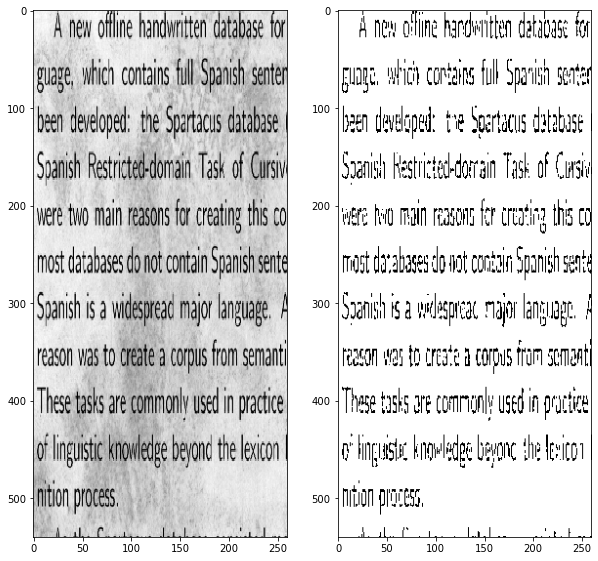

# Keras-Denoising-Autoencoders

Implementation of de-noising auto-encoders in Keras using the Denoising Dirty Documents dataset on <a href = "https://www.kaggle.com/c/denoising-dirty-documents">Kaggle</a>.

The same notebook is on Kaggle, <a href = "https://www.kaggle.com/daenys2000/keras-denoising-autoencoders">here</a>.

## Result
</img>

## Improvements possibe
1. Deeper convolutional layers
2. Different activation or loss functions
